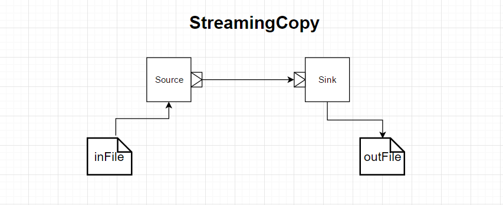
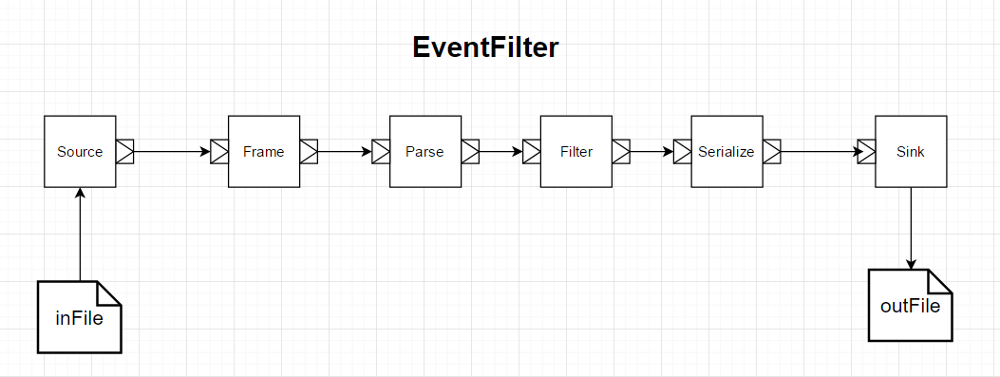

# AkkaInAction Streams
Java code for scala stream samples for the Akka In Action book.

##Runnable Classes

### StreamingCopy

**StreaminCopy.java** [StreaminCopy.scala](https://github.com/RayRoestenburg/akka-in-action/blob/master/chapter-stream/src/main/scala/aia/stream/StreamingCopy.scala)

This is a standalone independent class for copying a file from location A 
to location B.
Do change the file name and location as its hard coded and not using commanline arguements.
It shows the various ways it can be done and how the materializer is used to determine the outcome.
In the ebook its listing 13.2 -13.

### EventFilter
In the ebook it is listing 13.7 - 13.13

1. **EventFilter.java** [original EventFilter.scala](https://github.com/RayRoestenburg/akka-in-action/blob/master/chapter-stream/src/main/scala/aia/stream/EventFilter.scala)
The main runnable class file that sets up the flows to read a file (source), parse it, filter the lines based on a state, and write to filetered lines in a custom format (sink).
Don't use sparay-json, as for understanding the exercise its not needed.

2. **Event.java** [original Event.scala](https://github.com/RayRoestenburg/akka-in-action/blob/master/chapter-stream/src/main/scala/aia/stream/Event.scala)
Not equivalent to Scala code but close to get the general idea.

3. **LogStreamProcessor.java** [original LogStreamProcessor.scala](https://github.com/RayRoestenburg/akka-in-action/blob/master/chapter-stream/src/main/scala/aia/stream/LogStreamProcessor.scala)
Currently limited functionality, only whats required for the current exercise.

4. **State.java**
In the scala world its part of the Event.scala.

